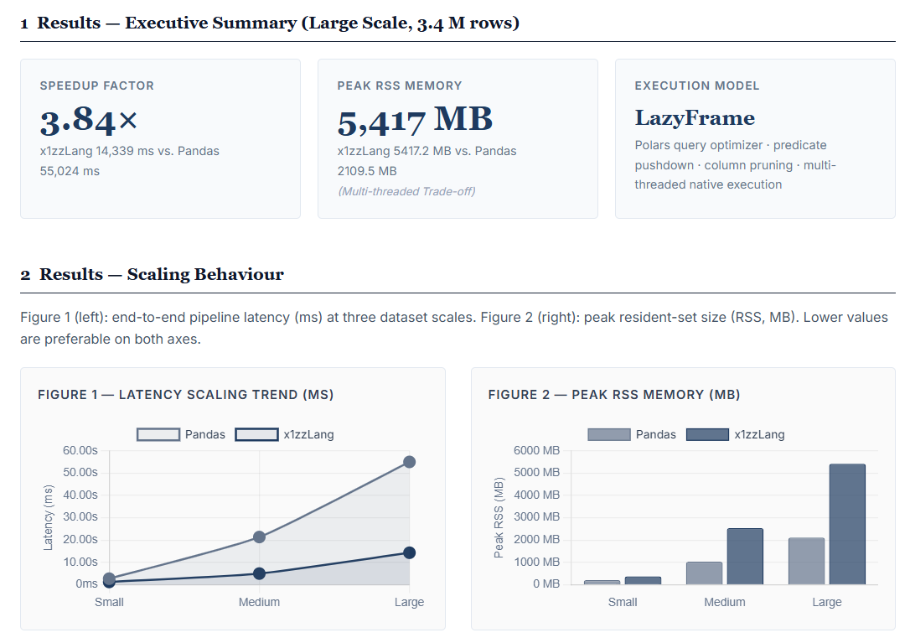
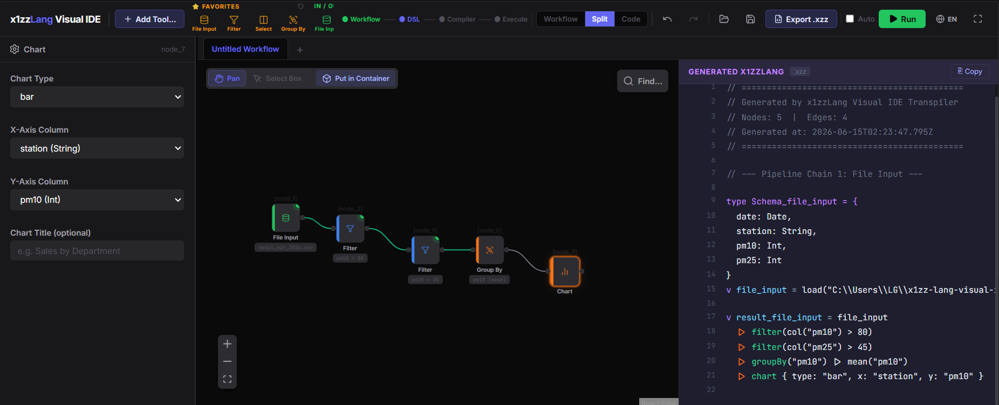

<div align="center">

```text
 ██╗  ██╗ ██╗ ███████╗███████╗██╗      █████╗ ███╗   ██╗ ██████╗ 
 ╚██╗██╔╝███║ ╚══███╔╝╚══███╔╝██║     ██╔══██╗████╗  ██║██╔════╝ 
  ╚███╔╝ ╚██║   ███╔╝   ███╔╝ ██║     ███████║██╔██╗ ██║██║  ███╗
  ██╔██╗  ██║  ███╔╝   ███╔╝  ██║     ██╔══██║██║╚██╗██║██║   ██║
 ██╔╝ ██╗ ██║ ███████╗███████╗███████╗██║  ██║██║ ╚████║╚██████╔╝
 ╚═╝  ╚═╝ ╚═╝ ╚══════╝╚══════╝╚══════╝╚═╝  ╚═╝╚═╝  ╚═══╝ ╚═════╝ 
```

# x1zzLang

**데이터 분석 접근성을 탐구하기 위해 설계된 Rust 기반 DSL 플랫폼.**  
*겉으로는 스크립트, 핵심은 컴파일러.*

[](LICENSE)
[]()
[]()
[](https://github.com/x1zzdev/x1zzLang/releases)

[English README](README.md)

</div>

---

## 프로젝트 소개

x1zzLang은 데이터 분석 도구의 접근성을 탐구하기 위해 설계된 DSL(도메인 특화 언어)이다.  
`.xzz` 스크립트를 Rust 기반 컴파일러 파이프라인을 통해 [Polars](https://github.com/pola-rs/polars) LazyFrame 실행 계획으로 컴파일한다.

이 프로젝트의 핵심은 **언어 설계**, **컴파일러 엔지니어링**, **타입 시스템 연구**다.  
기존 데이터 분석 도구를 대체하는 것이 목표가 아니다.

**이 프로젝트에서 확인할 수 있는 것:**
- `Option<T>` 기반 null-safe 타입 시스템을 가진 선언적 파이프라인 DSL
- Polars 같은 무거운 의존성을 CLI 바이너리에서 격리한 멀티 크레이트 Rust 워크스페이스 구조
- CSV 파일에서 타입 정의를 자동 생성하는 스키마 추론 도구 (`x1zz import`)
- 파이프라인 편집을 위한 Visual IDE

---

## 핵심 아이디어

기존 데이터 분석 워크플로는 실제 데이터를 만지기 전에 준비가 필요하다. Python 설치, 라이브러리 설치, 가상환경 구성, 컬럼 타입 수동 파악, NaN 처리...

x1zzLang은 다른 방향을 탐구한다. 스키마를 타입 선언으로 먼저 정의하고, null 안전성을 타입 시스템에서 강제하며, 파이프라인은 이름 있는 연산자의 조합으로 표현한다.

```
타입 선언 → 파이프라인 조합 → 컴파일된 실행
```

목적은 기존 도구를 대체하는 것이 아니라, 타입 안전한 데이터 파이프라인 언어를 처음부터 설계하면 어떤 형태가 되는지 탐구하는 것이다.

---

## 빠른 예제

**시나리오:** CSV 파일에서 공기질 데이터를 필터링하고 집계한다.

### Python (pandas)

```python
import pandas as pd

df = pd.read_csv("data.csv")
df = df[df["pm10"] > 50]
result = df.groupby("station")["pm10"].mean()
print(result)
```

*라이브러리 설치 필요. 타입 오류는 실행 시점에 발생. null 처리는 수동.*

### x1zzLang

```xzz
type AirQuality = {
  station: string,
  pm10:    Option<float>,
}

v data = load("data.csv") :: AirQuality
  |> cast("pm10", "float")
  |> filter(pm10 > 50)
  |> groupBy("station")
  |> mean("pm10")
```

*import 없음. 스키마를 먼저 선언. `Option<T>`로 null 안전 처리.*

| | Python (pandas) | x1zzLang |
|--|-----------------|----------|
| 라이브러리 의존성 | `pandas`, `numpy` | 없음 (내장) |
| 타입 검증 시점 | 런타임 | 스키마 선언 시 |
| Null 처리 | 수동 NaN 처리 | 타입 정의의 `Option<T>` |

**`x1zz import`부터 실행까지:**

```bash
x1zz new my-project    # 프로젝트 + 샘플 CSV 생성
cd my-project
x1zz import data.csv   # 스키마 자동 추론 → main.xzz에 타입 블록 기록
x1zz run main.xzz      # 컴파일 + 파이프라인 실행
```

---

## 실행 결과 미리보기

`chart {}` 블록이 포함된 파이프라인을 실행하면 HTML 차트로 결과를 렌더링한다.



> *예시: 파이프라인 실행 결과를 bar 차트로 렌더링. 차트 출력은 HTML 파일로 저장된다.*

---

## Visual IDE

[](https://github.com/x1zzdev/x1zzLang-visual-ide)

`.xzz` 파이프라인을 위한 그래픽 편집 및 실행 환경.  
→ [x1zzLang Visual IDE 저장소](https://github.com/x1zzdev/x1zzLang-visual-ide)

---

## 기능

| 기능 | 설명 | 상태 |
|------|------|------|
| `x1zz run` | `.xzz` 파이프라인 컴파일 및 실행 | Stable |
| `x1zz import` | CSV 스키마 자동 추론 → 타입 블록 생성 | Stable |
| `x1zz new` | 샘플 CSV + 실행 가능한 예제 포함 프로젝트 생성 | Stable |
| `x1zz emit rust` | `.xzz` → Rust 소스 변환 (Polars LazyFrame 호출) | Stable |
| `x1zz check` | Neural Query Planner 기반 정적 분석 | Experimental |
| `x1zz sde` | 합성 데이터 생성 엔진 연동 | Preview |
| 내장 `chart {}` | 파이프라인 결과를 bar / line / pie / scatter 차트로 렌더링 | Stable |
| `Option<T>` 타입 시스템 | null-safe 컬럼 선언, `fillNull` 연산자 | Stable |
| EUC-KR CSV 지원 | CP949 인코딩 한글 CSV 자동 감지 및 디코딩 | Stable |
| Visual IDE | 그래픽 파이프라인 편집기 (별도 저장소) | Stable |

---

## 아키텍처

x1zzLang은 의존성 격리를 의도적으로 설계한 Cargo 워크스페이스 구조를 사용한다.  
CLI 바이너리에는 Polars나 Tokio가 링크되지 않는다. 무거운 의존성은 실행 엔진 바이너리(`x1zz-runner` / `x1zz-exec`)에만 격리된다.

```
x1zz (CLI 바이너리)
│  clap + indicatif + colored + csv + anyhow + encoding_rs
│  Polars 없음  ·  Tokio 없음
│
├── x1zz-compiler          Lexer → Parser → Codegen → Emitter
│   └── x1zz-core          공유 AST / Token / Error 타입 (serde만)
│
└── [서브프로세스 스폰] ──► x1zz-runner
                           │
                           └── x1zz-exec       Polars LazyFrame 런타임
```

**크레이트별 역할:**

| 크레이트 | 역할 | 무거운 의존성 |
|----------|------|--------------|
| `x1zz` (CLI) | 인자 파싱, import, new, emit, check | 없음 |
| `x1zz-core` | 공유 AST, Token, Error 타입 | serde만 |
| `x1zz-compiler` | Lexer / Parser / Codegen / Emitter | 없음 |
| `x1zz-exec` | Polars 실행 엔진 | **Polars, encoding_rs** |
| `x1zz-runner` | 실행 바이너리 (CLI가 스폰) | x1zz-exec 통해 간접 |
| `x1zz-sde` | 합성 데이터 생성기 (독립) | polars, rayon |
| `x1zz-server` | REST API 서버 (독립) | axum, tokio |

**이 구조를 선택한 이유:**  
CLI 바이너리는 Polars를 링크하지 않아 ~2–5 MB를 유지한다. `x1zz run` 호출 시 `x1zz-runner`를 서브프로세스로 스폰한다. 러너가 Polars 의존성 전체를 담당한다. 두 바이너리 간 통신은 CLI 인자만 사용한다(별도 IPC 없음).

**바이너리 크기 분리:**

| 바이너리 | 예상 크기 | 포함 내용 |
|----------|----------|----------|
| `x1zz` (CLI) | ~2–5 MB | 컴파일러, 스키마 추론, 프로젝트 생성 |
| `x1zz-runner` | ~30+ MB | Polars 실행 엔진 |

상세 내용은 [docs/WORKSPACE.md](docs/WORKSPACE.md) 참고.

---

## 설치

### Option A — 사전 빌드 릴리스 (권장)

1. [Releases](https://github.com/x1zzdev/x1zzLang/releases)에서 플랫폼에 맞는 아카이브를 다운로드한다.

   | 플랫폼 | 아카이브 |
   |--------|---------|
   | Windows x64 | `x1zz-<version>-windows-x64.zip` |
   | Linux x64 | `x1zz-<version>-linux-x64.tar.gz` |
   | macOS arm64 | `x1zz-<version>-macos-arm64.tar.gz` |

2. 아카이브를 압축 해제한다. `x1zz`와 `x1zz-runner`가 같은 디렉토리에 있어야 한다.

   > **주의:** 두 바이너리는 반드시 같은 디렉토리에 있어야 한다. `x1zz run`은 `x1zz-runner`를 서브프로세스로 스폰하기 때문에 `x1zz-runner`가 없으면 파이프라인 실행이 실패한다.

3. 압축 해제한 디렉토리를 `PATH`에 추가한다.

4. 확인:

   ```bash
   x1zz --help
   ```

### Option B — 소스에서 빌드

Rust stable 툴체인이 필요하다.

```bash
git clone https://github.com/x1zzdev/x1zzLang.git
cd x1zzLang

# CLI 빌드
cargo build --release -p x1zz

# 실행 엔진 빌드
cargo build --release -p x1zz-runner

# 두 바이너리 모두 target/release/에 생성됨
```

실행 전에 `x1zz`와 `x1zz-runner`를 같은 디렉토리에 배치한다.

---

## 벤치마크


서울 공기질 데이터셋 340만 행을 기준으로 x1zzLang과 동일한 pandas 파이프라인을 비교했다.

> 해당 워크로드에서 pandas 대비 최대 **3.84배 빠른** 실행 속도를 달성했다.

이 성능은 주로 Polars LazyFrame 백엔드 덕분이다. Polars는 실행 전에 쿼리 최적화를 적용한다. 벤치마크는 컴파일러 오버헤드가 아닌 엔드-투-엔드 파이프라인 처리량을 측정한다.

벤치마크 소스: [`benches/run_benchmark.py`](benches/run_benchmark.py) / [`benches/benchmark_pipeline.xzz`](benches/benchmark_pipeline.xzz)

---

## 로드맵

| Phase | 목표 | 상태 |
|-------|------|------|
| Phase 1 — Core Language | DSL 문법, 타입 시스템, 컴파일러 파이프라인 | 완료 |
| Phase 2 — Execution Layer | Polars 연동, CLI 도구, 차트 출력 | 완료 |
| Phase 3 — IDE Integration | Visual IDE, 그래픽 파이프라인 편집기 | 완료 |
| Phase 4 — Expanded Language | 연산자 확장, join 개선, 스키마 진화 | 진행 중 |
| Phase 5 — AI Expansion | 자연어 쿼리 인터페이스 (NQP), AI 기반 분석 | Experimental |

---

## 기여

버그 제보, 아이디어, 논의는 GitHub Issues로 언제든 환영한다.

**코드 기여(Pull Request) 관련:**  
2026년 제8회 한국코드페어 평가 기간 동안 저작자 동일성 보장을 위해 코드 기여(PR)는 2026년 10월까지 임시 중단 상태다. 대회 종료 후 재개된다.

- 이슈(버그 제보, 아이디어, 논의): 항상 열려 있음
- Pull Request: 2026년 10월까지 중단

로컬 빌드 방법과 기여 가이드는 [CONTRIBUTING.md](CONTRIBUTING.md) 참고.

---

## 라이선스

Apache-2.0 — 자세한 내용은 [LICENSE](LICENSE) 참고.

---

<div align="center">

**x1zzLang — 2026**

</div>
