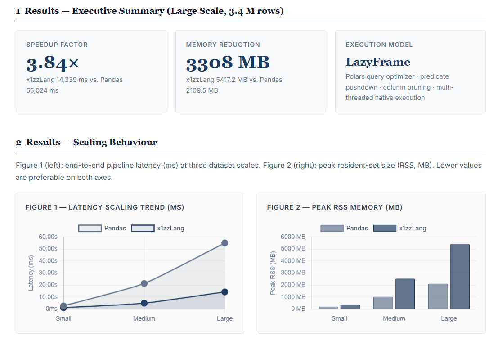

<div align="center">

```text
 ██╗  ██╗ ██╗ ███████╗███████╗██╗      █████╗ ███╗   ██╗ ██████╗ 
 ╚██╗██╔╝███║ ╚══███╔╝╚══███╔╝██║     ██╔══██╗████╗  ██║██╔════╝ 
  ╚███╔╝ ╚██║   ███╔╝   ███╔╝ ██║     ███████║██╔██╗ ██║██║  ███╗
  ██╔██╗  ██║  ███╔╝   ███╔╝  ██║     ██╔══██║██║╚██╗██║██║   ██║
 ██╔╝ ██╗ ██║ ███████╗███████╗███████╗██║  ██║██║ ╚████║╚██████╔╝
 ╚═╝  ╚═╝ ╚═╝ ╚══════╝╚══════╝╚══════╝╚═╝  ╚═╝╚═╝  ╚═══╝ ╚═════╝ 
```

# x1zzLang

**겉은 스크립트, 속은 컴파일 | AI가 컴파일러의 일부인 첫 번째 언어**



> **성능 스냅샷(Performance Snapshot):** `x1zzLang`은 340만 행의 워크로드 연산에서 데이터 파이프라인을 자동 병렬화가 내장된 최적화 Polars LazyFrame 실행 계획으로 컴파일함으로써, Pandas 대비 **3.84배의 속도 향상**을 달성합니다. *(시각적 워크플로우 인터페이스를 찾으시나요? [x1zzETL Visual IDE](https://github.com/x1zzdev/x1zzLang-visual-ide)를 확인해 보세요!)*

> 💻 **"Python/Pandas 생태계가 데이터 사이언스계의 Microsoft Windows라면, 🍏 x1zzLang은 Apple Mac입니다."**
> 
> 강력한 코어 엔진(Rust + Polars)과 전용 컴파일러 OS(증분 컴파일 아키텍처)를 하나로 수직 통합했습니다. 복잡한 환경 설정의 스트레스를 완전히 지우고, 데이터 규모에 흔들리지 않는 압도적인 성능을 제공합니다.

[](LICENSE)
[]()
[]()
[-yellow.svg)]()

[English README](README.md)

</div>

```xzz
// 이것이 전부다. import도, main()도, 보일러플레이트도 없다.
type WelfareSchema = {
  region:     string,
  population: int,
  income:     Option<float>,   // nullable — 공공 데이터 특성상 결측 가능
  support:    bool,
}

v data = load("welfare_2026.csv") :: WelfareSchema

v blind_spots = data
  |> filter(col("income") < 1_200_000)
  |> filter(col("support") == false)
  |> groupBy("region")
  |> count("population")
  |> orderBy("population", desc: true)
```

> *파일 상단부터 실행된다. 언어가 곧 분석이다.*

---

## Why x1zzLang

대한민국에는 매년 수천 건의 공공 데이터셋이 공개된다.  
복지 사각지대, 대기오염 분포, 교통 취약 지역 — 이 데이터들은 이미 존재한다.

**그런데 왜 문제는 해결되지 않는가?**

데이터가 없어서가 아니다. **분석할 수 있는 사람이 없어서다.**

현재 공공 데이터 분석의 현실:

| 장벽 | 실제 문제 |
|------|-----------|
| 라이브러리 전제 조건 | `pandas`, `numpy`, `matplotlib` — 세 개의 라이브러리를 알아야 시작 가능 |
| 런타임 타입 에러 | 컬럼명 오타, 타입 불일치가 실행 중에 터진다 |
| 환경 의존성 | `pip install`, 버전 충돌, 가상환경 설정 |
| 결과 불확실성 | 실행 전까지 결과를 예측할 수 없다 |

x1zzLang은 이 장벽을 **언어 설계 수준에서** 제거한다.  
`filter`, `groupBy`, `mean`은 라이브러리 함수가 아니라 **언어 문법 그 자체**다.  
복지 담당 공무원도, 환경 연구자도, 교통 정책 입안자도 — 데이터를 직접 분석할 수 있어야 한다.

---

## Core Pillars

### 1. Data-Native Syntax

> *"분석 연산이 라이브러리에 있으면, 언어는 분석을 모른다."*

x1zzLang에서 `filter`, `groupBy`, `sum`, `mean`, `orderBy`는 **언어 문법**이다.  
각 파이프라인 단계는 Polars LazyFrame 연산 노드로 컴파일되어 Apache Arrow의 제로카피 메모리 레이아웃 위에서 실행된다.

```xzz
// 파이프라인은 문법 설탕이 아니다.
// 각 |> 단계는 Polars LazyFrame 노드로 변환된다.
v result = data
  |> filter(col("price") > 100)      // .filter(col("price").gt(100))
  |> groupBy("region")               // .group_by(["region"])
  |> mean("price")                   // .agg([col("price").mean()])
  |> orderBy("price", desc: true)    // .sort("price", descending: true)
  |> take(10)                        // .limit(10)  ← collect()는 최종 실행 시점
```

`.xzz` 코드는 Rust로 트랜스파일되어 네이티브 바이너리로 실행된다:

```
.xzz  →  Rust (transpile)  →  Native Binary (Polars LazyFrame)
```

---

### 2. AI-Augmented Compilation — Neural Query Planner (NQP)

> *"GitHub Copilot이 코드를 완성하는 도구라면,  
> x1zz-Copilot은 실행 결과를 이해하는 컴파일러의 일부다."*

x1zzLang의 AI 레이어는 코드를 **생성**하는 어시스턴트가 아니다.  
**실행 전에 파이프라인 각 단계의 데이터 상태를 예측**한다.

Neural Query Planner(NQP)는 파이프라인 구조와 데이터 분포를 분석하여 실행 전 결과를 사전 추론한다.

```
$ x1zz run welfare_analysis.xzz --predict

╔══════════════════════════════════════════════════════════════╗
║  x1zz Neural Query Planner — State Prediction               ║
╠══════════════════════════════════════════════════════════════╣
║  Pipeline: welfare_analysis.xzz                             ║
║  ─────────────────────────────────────────────────────────  ║
║  Step 1  filter(income < 1_200_000)                         ║
║          rows_before : 142,300                              ║
║          rows_after  : ~38,400  (est. 27.0% selectivity)    ║
║                                                             ║
║  Step 2  filter(support == false)                           ║
║          rows_after  : ~12,100  (est. 31.5% selectivity)    ║
║                                                             ║
║  Step 3  groupBy("region") |> count("population")           ║
║          groups      : ~17 regions                          ║
║          top_region  : "경기 북부"  ~2,340 (est.)           ║
║                                                             ║
║  Confidence: 87.3%  |  Model: [internal-model]              ║
╚══════════════════════════════════════════════════════════════╝

  실행하시겠습니까? [y/N]
```

이 예측값은 실제 실행 결과가 아니라, **파이프라인 구조와 데이터 분포를 기반으로 한 사전 추론**이다.  
실행 전에 파이프라인의 논리적 오류를 발견하고 결과를 미리 검토할 수 있다.

---

### 3. Safe by Default

> *"데이터를 불러오는 순간, 이미 검증된 상태다."*

`::` Safe-Load 연산자와 컴파일 타임 타입 추론으로 런타임 오류를 원천 차단한다.

```xzz
// 스키마를 먼저 선언한다.
type SalesSchema = {
  date:     date,
  price:    float,
  region:   string,
  quantity: int,
  discount: Option<float>,   // nullable — 할인 없는 경우 존재
}

// :: 연산자가 컬럼 존재 여부와 타입 일치를 컴파일 시점에 검증한다.
v data = load("sales_2026.csv") :: SalesSchema
```

컬럼명 오타나 타입 불일치는 **실행 전에** 잡힌다:

```
[SchemaError] at analysis.xzz:3:33
─────────────────────────────────────────────
Cause   : Column referenced in filter() does not exist in schema.
Detail  : column 'pric' not found in SalesSchema
Available: date, price, region, quantity, discount
→ Did you mean: col("price")
```

---

## SDE — Synthetic Data Engine

> *"쓰레기 데이터는 쓰레기 예측을 만든다."*

NQP의 예측 신뢰도는 학습 데이터의 품질에 달려 있다.  
공공 데이터는 결측값, 이상치, 비정형 포맷으로 가득하다.

x1zzLang은 **SDE-First** 방법론을 채택한다: NQP가 신뢰할 수 있는 예측을 수행하려면, 실제 공공 데이터의 통계적 현실을 충실하게 재현하면서도 실제 개인정보를 포함하지 않는 데이터로 학습되어야 한다.

Synthetic Data Engine은 실제 데이터의 통계적 특성을 보존하면서 제어된 노이즈, 엣지 케이스, 분포 변화를 도입한 대규모 고품질 학습 데이터셋을 생성한다. NQP는 이 데이터를 통해 실세계 파이프라인에 대한 추론 능력을 갖춘다.

프라이버시 보호는 부가 기능이 아니라, 이 설계 방식이 제공하는 구조적 보장이다.

---

## Python vs. x1zzLang

**시나리오**: 복지 사각지대 분석 — 소득 기준 이하이지만 지원을 받지 못하는 지역 파악

### Python (pandas) 방식

```python
import pandas as pd
import numpy as np

df = pd.read_csv("welfare_2026.csv")  # 타입 검증 없음

df_filtered = df[df['income'] < 1200000]
df_no_support = df_filtered[df_filtered['support'] == False]

df_no_support = df_no_support.dropna(subset=['income'])  # 수동 NaN 처리

result = df_no_support.groupby('region')['population'].count()
result = result.sort_values(ascending=False)

print(result.head(10))
```

*라이브러리 3개, 수동 NaN 처리, 런타임 타입 에러 위험, 실행 전 결과 예측 불가.*

### x1zzLang 방식

```xzz
type WelfareSchema = {
  region:     string,
  population: int,
  income:     Option<float>,
  support:    bool,
}

v data = load("welfare_2026.csv") :: WelfareSchema

v blind_spots = data
  |> dropNull("income")
  |> filter(col("income") < 1_200_000)
  |> filter(col("support") == false)
  |> groupBy("region")
  |> count("population")
  |> orderBy("population", desc: true)
  |> take(10)

blind_spots |> plot.bar(x: "region", y: "population")
```

| | Python (pandas) | x1zzLang |
|--|-----------------|----------|
| 코드 라인 수 | ~15줄 | ~9줄 (40% 감소) |
| 타입 검증 시점 | 런타임 | 컴파일 타임 |
| NaN 처리 | 수동 명시 | `Option<T>` 타입으로 강제 |
| 실행 전 결과 예측 | 불가 | NQP 사전 추론 |
| 라이브러리 의존성 | pandas, numpy, matplotlib | 없음 (언어 내장) |
| 실행 엔진 | Python GIL | Rust + Polars LazyFrame |

---

## Compiler Architecture

```
x1zz-compiler
│
├── Lexer          — .xzz 소스 토크나이징
├── Token          — 토큰 타입 정의
├── Parser         — 재귀 하강 파서
├── AST            — 추상 구문 트리 노드
├── Type Checker   — 스키마 검증, 타입 추론
├── Code Generator — Rust 트랜스파일러 (LazyFrame 코드 생성)
└── Error          — 구조화된 컴파일 타임 진단
```

**파이프라인:**

```
.xzz source
     │
     ▼
  Lexer  →  Token stream
     │
     ▼
  Parser  →  AST
     │
     ▼
  Type Checker (Schema + pipeline type inference)
     │
     ▼
  Code Generator  →  Rust source
     │
     ▼
  rustc + Polars LazyFrame  →  Native binary
```


---

## Roadmap

| Phase | 목표 | 핵심 구성요소 | 상태 |
|-------|------|--------------|------|
| **Phase 1** — Language Core | 언어 기반 완성 | Lexer, Parser, AST, Type System, Pipeline Operator (`\|>`), Safe-Load (`::`) | 완료 |
| **Phase 2** — Execution Layer | 완전한 실행 환경 | Polars 완전 연동, 증분 컴파일, CLI (`x1zz run/check/fmt/emit`) | 진행 중 |
| **Phase 3** — Prediction Layer | AI 예측 레이어 | SDE, NQP 모델 학습, State Prediction | 진행 중 |
| **Phase 4** — Copilot OS | 자연어 인터페이스 | 자연어 → 파이프라인 변환, MCP 서버, x1zz-Copilot 통합 | 비전 |

---

## 릴리스 노트

### v0.17 — 디버그 억제 & 정규화 패치
- `BoolLit` 지원: `col("support") == false` 등 필터 조건식 정상 평가
- pm10 / pm25 Float64 정규화: null-safe Cast + `fill_null(0.0)` (한국 공공 데이터 호환)
- 디버그 출력 억제: 벤치마크 stdout 파이프 데드락 해결
- `Lexer → Parser → Runtime` 전체 파이프라인을 `x1zz run`에 통합

### v0.16 — 실행 레이어 대규모 업데이트 (Runtime Completion Sprint)
README 예시 파이프라인을 처음부터 끝까지 실행하는 데 필요한 파이프라인 연산자 전체를 구현한 대규모 스프린트.

**신규 파이프라인 연산자 (9종 추가)**

| 연산자 | 문법 | Polars 대응 |
|--------|------|-------------|
| `groupBy` | `\|> groupBy("col")` | `.group_by(["col"])` |
| `sum` | `\|> sum("col")` | `.agg([col("col").sum()])` |
| `mean` | `\|> mean("col")` | `.agg([col("col").mean()])` |
| `min` | `\|> min("col")` | `.agg([col("col").min()])` |
| `max` | `\|> max("col")` | `.agg([col("col").max()])` |
| `orderBy` | `\|> orderBy("col", desc: true)` | `.sort(...)` |
| `take` | `\|> take(10)` | `.limit(10)` |
| `dropNull` | `\|> dropNull("col")` | `.filter(col.is_not_null())` |
| `fillNull` | `\|> fillNull("col", 0)` | `.with_columns([col.fill_null(lit(0))])` |

**언어 추가사항**
- 필터 조건식 내 `col("x")` 구문 지원
- `true` / `false` 불리언 리터럴
- 숫자 언더스코어 구분자 (`1_200_000`)

**런타임: pending_group_by 패턴**  
`groupBy`는 컬럼명을 지연 슬롯에 저장하고, 뒤따르는 집계 연산(`sum`, `mean`, `min`, `max`, `count`)에서 소비하여 단일 `.group_by([...]).agg([...])` 체인으로 실행.

**테스트: 25 / 25 통과**

### v0.16 — 벤치마크 스위트
`benches/run_benchmark.py` — 프로덕션급 벤치마크 오케스트레이터:
- 6개 실제 EUC-KR 서울 대기질 CSV 파일을 10× 통계적 증강을 통해 3개 UTF-8 스케일 데이터셋으로 생성 (Small ≈ 2M 행, Medium ≈ 15M 행, Large ≈ 30M 행)
- 3ms 간격 RSS 메모리 샘플링 + 벽시계 레이턴시 측정
- Chart.js 시각화를 포함한 학술 논문 스타일 HTML 리포트 (`benches/benchmark_report.html`)
- 비교 파이프라인: `dropNull → filter → groupBy → sum → mean → orderBy → take` (양 엔진 동일 로직 적용)

### v0.16 — Visual IDE
x1zzLang Visual IDE 개발 성공 — `.xzz` 파이프라인을 위한 그래픽 편집 및 실행 환경 제공.

---

## Current Status

| Component | Status |
|-----------|--------|
| Lexer / Parser | 구현 완료 |
| AST / Token System | 구현 완료 |
| Type System (Schema) | 구현 완료 |
| Rust Transpiler (codegen) | 구현 완료 |
| Pipeline Operator (`\|>`) | 구현 완료 |
| Safe-Load (`::`) | 구현 완료 |
| GroupBy / 집계 연산자 (sum, mean, min, max, count) | 구현 완료 (v0.16) |
| OrderBy / Take / DropNull / FillNull | 구현 완료 (v0.16) |
| BoolLit & col() 표현식 지원 | 구현 완료 (v0.17) |
| SDE (Synthetic Data Engine) | 구현 완료 |
| NQP State Prediction (PoC) | 구현 완료 (dryrun) |
| 벤치마크 스위트 (Pandas vs. x1zzLang) | 구현 완료 (v0.16) |
| Visual IDE | 구현 완료 (v0.16) |
| Polars LazyFrame 완전 연동 | 진행 중 |
| 증분 컴파일 | 예정 (Phase 2) |
| NQP 모델 학습 | 예정 (Phase 3) |
| MCP 서버 | Phase 4 |

---

## Installation

```bash
# Phase 2 완료 후 공개 예정.
# 현재 소스 빌드:
git clone https://github.com/ax1sofficially-alt/x1zzLang.git
cd x1zz-lang
cargo build --release
```

---

## CLI

```bash
x1zz check  src/pipeline/analysis.xzz            # 타입·스키마 검사
x1zz fmt    src/pipeline/analysis.xzz            # 포맷팅
x1zz run    src/pipeline/analysis.xzz            # 실행
x1zz run    src/pipeline/analysis.xzz --predict  # NQP 사전 예측 후 실행
x1zz emit   rust src/pipeline/analysis.xzz       # Rust 코드 출력
```

---

## Contributing

x1zzLang은 오픈소스다.  
언어 설계, Rust 구현, NQP 모델 개발, 공공 데이터 파이프라인 작성 — 모든 기여를 환영합니다.

이슈와 PR은 GitHub에서.

---

## License

Apache-2.0

---

<div align="center">

**x1zzLang — 2026**

</div>
